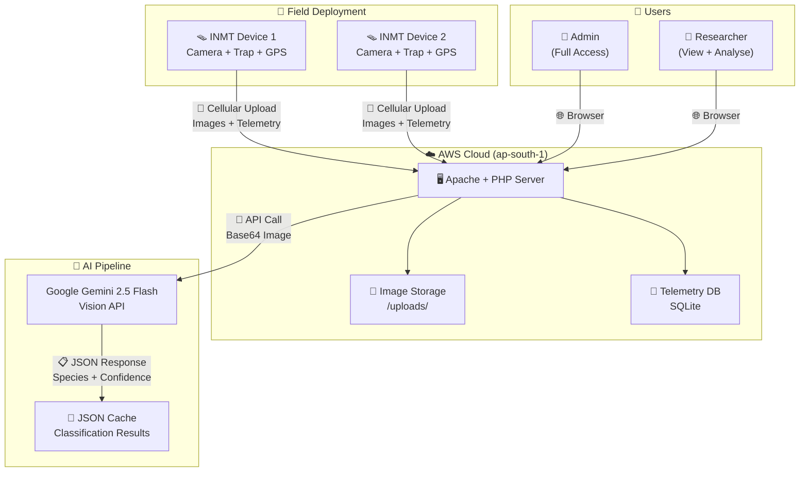
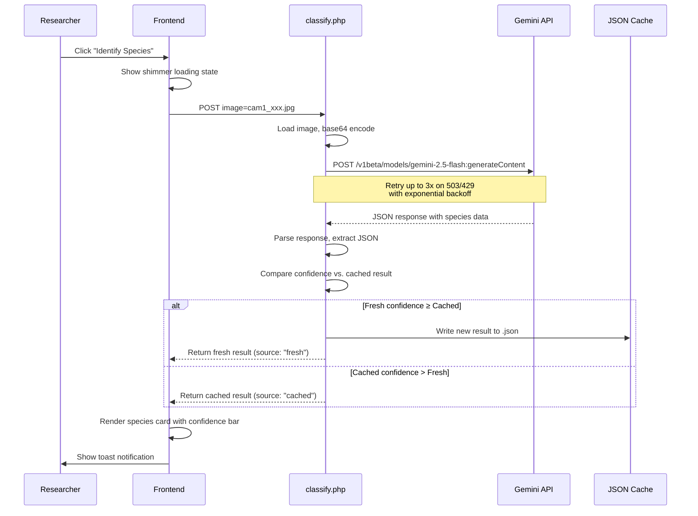
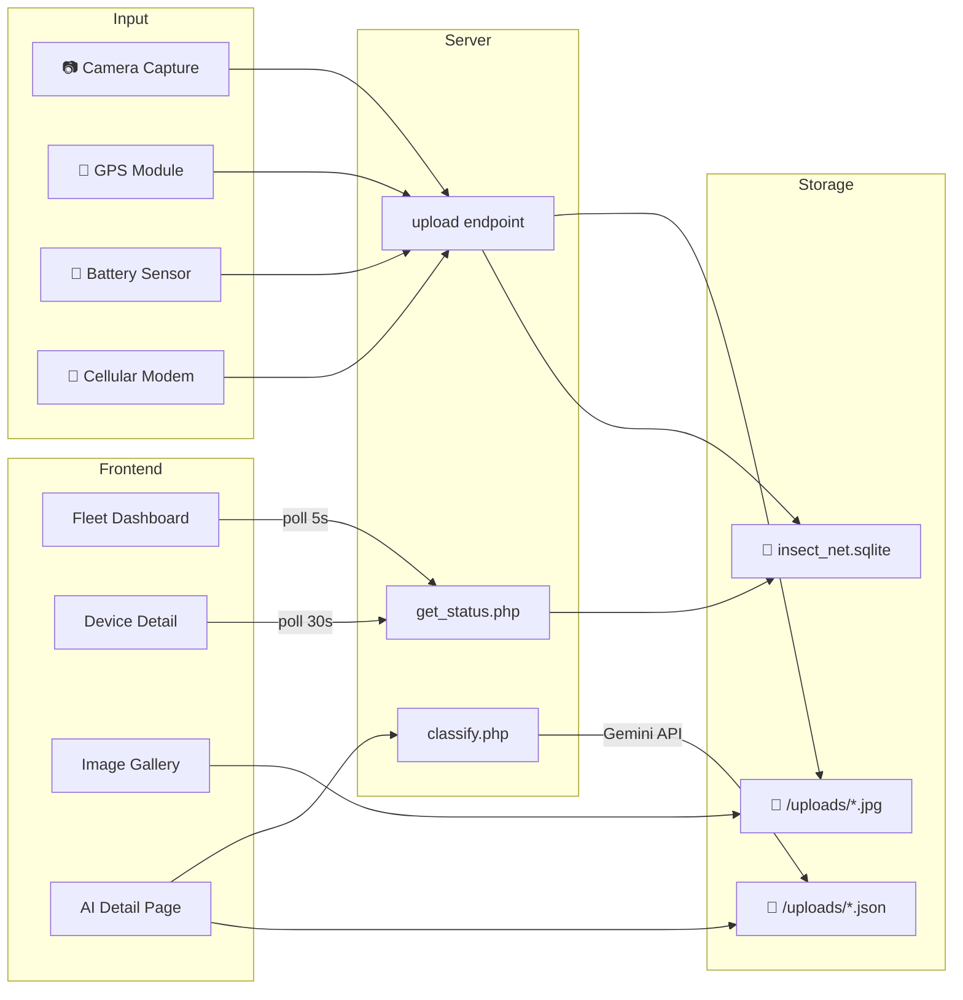

# INSECT NET — Mission Control

## Technical Documentation & Achievement Report

**Organization:** NeuRonICS Lab, Indian Institute of Science (IISc), Bangalore  
**Platform URL:** `http://65.2.30.116/`  
**Version:** 2.0  
**Date:** April 28, 2026  

---

## 1. Introduction & Purpose

**Insect NET Mission Control** is a full-stack IoT monitoring and AI-powered insect identification platform developed for agricultural pest surveillance. It is designed and operated by the **NeuRonICS Lab at IISc Bangalore** — one of India's premier research institutions.

### 1.1 The Problem

Agricultural pests, particularly fruit flies of the genus **Bactrocera**, cause billions of dollars in crop damage worldwide. Early detection and monitoring of pest populations is critical for integrated pest management (IPM), but traditional methods rely on manual field inspections — a process that is labor-intensive, inconsistent, and poorly scalable.

### 1.2 The Solution

Insect NET deploys **autonomous IoT trap devices (INMT)** in agricultural fields. These devices:
- Capture high-resolution images of insect traps at regular intervals
- Transmit images and telemetry (GPS, battery, signal strength) to a central server via cellular modem
- Store all data in a cloud dashboard accessible to researchers from anywhere

The **Mission Control dashboard** then applies **Google Gemini AI** to automatically classify captured insects, track pest populations over time, and provide researchers with real-time fleet monitoring.



---

## 2. System Architecture

### 2.1 Technology Stack

| Layer | Technology | Purpose |
|-------|-----------|---------|
| **Server** | Apache on AWS EC2 (t2.micro, ap-south-1) | Web hosting + API endpoints |
| **Backend** | PHP 8.x (vanilla, no framework) | Server-side rendering + API logic |
| **Frontend** | Vanilla HTML/CSS/JavaScript | Dashboard UI with no build step required |
| **Maps** | Leaflet.js 1.9.4 + OpenStreetMap | Device location visualization |
| **AI** | Google Gemini 2.5 Flash (Vision API) | Insect species classification |
| **Auth** | PHP Sessions + bcrypt (PASSWORD_BCRYPT, cost=10) | Secure authentication |
| **Storage** | Filesystem (images) + JSON (cache/users) + SQLite (telemetry) | Persistent data |
| **Fonts** | Google Fonts: Space Mono, Inter, Outfit | Typography system |
| **IoT** | Custom INMT hardware with camera + cellular modem | Field data collection |

### 2.2 File Structure

```
insect-net-mission-control-main/
├── index.php           # Main dashboard (landing + fleet + device detail)
├── login.php           # Authentication page
├── logout.php          # Session destruction + redirect
├── config.php          # Session config, auth helpers, CSRF, password utils
├── classify.php        # Gemini AI classification endpoint
├── image_detail.php    # Individual image AI analysis page
├── delete_image.php    # Admin-only image deletion endpoint
├── clear_cache.php     # Clear AI classification cache for an image
├── admin_api.php       # Admin user management REST API
├── 404.html            # Custom error page
├── .htaccess           # Apache configuration & access rules
├── users.json          # User credentials database (bcrypt hashed)
├── neuronics_logo.png  # NeuRonICS Lab logo
├── iisc_logo.jpg       # IISc Bangalore logo
└── uploads/            # Trap images + JSON classification cache
    ├── cam1_*.jpg       # Device 1 captures
    ├── cam1_*.json      # AI classification results
    └── insect_net.sqlite # Telemetry database
```

---

## 3. Features — Detailed Walkthrough

### 3.1 Secure Authentication System


The login system implements multiple security layers:

- **bcrypt Password Hashing** — All passwords are hashed using `PASSWORD_BCRYPT` with cost factor 10 before storage. Plain-text passwords never touch the disk.
- **CSRF Protection** — A 64-character cryptographic token is generated per session using `random_bytes(32)` and validated on every login submission to prevent cross-site request forgery.
- **Session Timeout** — Sessions automatically expire after **30 minutes** of inactivity. Expired sessions redirect to the login page with a clear warning message ("Your session expired due to inactivity").
- **Role-Based Access Control** — Two roles exist:
  - `admin` — Full access: manage users, delete images, all dashboard features
  - `user` — View dashboard, run AI analysis, download images
- **Secure Logout** — The logout process destroys the session, clears session data, deletes the session cookie, and redirects with a confirmation message.

The login page features the same design system as the dashboard: dark/light theme toggle, institutional branding (NeuRonICS + IISc logos), and animated background orbs.

---

### 3.2 Landing Page


The landing page serves as the entry point to the dashboard after login. It features:

- **Institutional Branding** — Both the NeuRonICS Lab and IISc Bangalore logos are displayed in a glass-morphism card with a subtle divider
- **Animated Background** — A CSS grid overlay with two floating gradient orbs that animate smoothly using `@keyframes floatA`, creating depth and visual interest
- **Typography** — The "INSECT NET" title uses Space Mono at `clamp(2em, 6vw, 4.2em)` for fluid scaling from mobile to desktop
- **Call to Action** — A gradient pill button ("ENTER DASHBOARD") with a hover lift effect and glow shadow leads to the fleet overview

---

### 3.3 Fleet Dashboard — Real-Time Device Monitoring


The fleet dashboard is the central command view, providing an at-a-glance overview of all deployed devices.

#### Device Cards
Each INMT device is represented by a card showing:
- **Status Indicator** — Color-coded badge (🟢 Online / 🟡 Stale / 🔴 Offline) based on time since last telemetry
  - Online: data received within 5 minutes
  - Stale: data received within 1 hour
  - Offline: no data for over 1 hour
- **Battery Voltage** — Real-time battery reading with a gradient progress bar
- **Last Seen** — Human-readable timestamp ("33 days ago", "Just now")
- **Last Capture Date** — Date of most recent image capture
- **Image Count** — Total stored images for the device
- **Left Border Color** — Dynamically matches the device status color

#### Real-Time Polling Engine
The dashboard polls `get_status.php` every **5 seconds** for each device. The polling system includes:
- **Countdown Ring** — An SVG circle that animates its stroke-dashoffset in sync with the poll interval, giving visual feedback
- **Pulse Dot** — A green dot that pulses on each successful data fetch
- **Status Change Toasts** — When a device transitions between states (e.g., online → offline), a toast notification appears with an appropriate emoji

#### Fleet Map
An embedded **Leaflet.js map** powered by OpenStreetMap tiles displays:
- Device markers at their GPS coordinates (defaulting to Bengaluru)
- Popup cards with device name, status, battery reading, and a "VIEW" link
- An **Expand** button that opens a fullscreen map overlay
- Markers update position on each poll when new GPS coordinates arrive

---

### 3.4 Device Detail Dashboard


Clicking a device card navigates to its dedicated dashboard, which includes:

#### Live Location Map
A single-device Leaflet map centered on the device's GPS coordinates with expandable fullscreen mode. The marker position updates every 30 seconds when new telemetry arrives.

#### Modem Status Panel
Displays the device's cellular connection status:
- **Signal Strength Bar** — A gradient progress bar showing connectivity health
- **GPS Coordinates** — Live lat/lng display (e.g., "13.01870, 77.57080")
- Status text ("Link Active" / "No Signal")

#### Captures Per Day Chart
A custom-built bar chart (no chart library dependency) visualizing image capture frequency:
- Shows the **last 14 days** of activity
- Each bar height is proportionally scaled with a maximum height of 56px
- **Hover tooltips** show the exact count and date
- **Staggered animation** — bars grow from bottom with CSS transitions and delayed start times
- A **total badge** shows the aggregate count (e.g., "73 total")

---

### 3.5 Image Gallery & Management


The gallery is a responsive grid displaying all captured trap images for a device.

#### Gallery Features
- **Lazy Loading** — Images use `IntersectionObserver` to load only when scrolled into view, with a 200px root margin for pre-loading
- **Shimmer Placeholders** — While loading, each image slot shows an animated shimmer effect using CSS `background-position` animation
- **Date Grouping** — Images are grouped under date headings (e.g., "March 26, 2026") with most recent first
- **"✓ Analysed" Badge** — Images with an existing AI classification cache display a green badge
- **Hover Actions** — On hover, three action buttons appear:
  - 🔬 **View Details** — Opens the AI identification page (with loading animation)
  - 🗑 **Delete** (admin only) — Two-click confirm: first click shows "⚠ Confirm?" for 2.5 seconds
  - ⬇ **Save** — Direct download link

#### Gallery Controls
- **Date Filter** — A text input that filters images by date string matching
- **Sort Dropdown** — "Group by Date" (default) or "Latest First" (flat list)
- **Image Count** — Shows total visible images, updated dynamically on filter

#### Species Summary Table
Below the chart, a data table aggregates all AI identifications:

| Column | Description |
|--------|-------------|
| Species | Scientific name (e.g., *Bactrocera sp.*) |
| Common Name | Common name (e.g., Fruit Fly) |
| Count | Number of images identified as this species |
| Best Confidence | Highest confidence score with a gradient bar |
| Latest | Most recent identification date |

A **CSV Export** button generates a downloadable file with columns: Image, Species, Common Name, Confidence (%), Date.

#### Image Lightbox
Clicking any thumbnail opens a modal lightbox with:
- Full-resolution image display
- **← Prev / Next →** navigation buttons
- **Keyboard navigation** (Arrow keys + Escape)
- **Touch swipe** support for mobile devices
- **⬇ Save** download button
- Image filename and position counter ("3 / 73")

---

### 3.6 AI-Powered Species Identification


The crown jewel of the platform — each image can be analyzed by **Google Gemini 2.5 Flash** for automated insect classification.

#### Classification Pipeline



#### AI Prompt
The system sends the following prompt to Gemini along with the base64-encoded trap image:

> *"Identify the insects stuck on this trap. IGNORE the central wooden block. Focus on identifying if these are fruit flies (Bactrocera). Return ONLY a JSON object: { "species": "...", "common_name": "...", "confidence": 0.95, "description": "..." }"*

#### Smart Confidence Caching
The system implements an intelligent caching strategy:
1. If no cached result exists → save the fresh result
2. If cached confidence > fresh confidence → **keep the cached result** (higher quality answer preserved)
3. If fresh confidence ≥ cached confidence → **overwrite with fresh result**
4. If the API returns a mock/fallback result (503/429) → **never cache it**

The response includes metadata (`source`, `conf_change`, `is_mock`, `old_conf`) so the frontend can display:
- **▲ +3%** green pill — confidence improved
- **▼ -5%** red pill — confidence dropped (cache kept)
- **— Same** neutral pill — no change

#### Resilience Features
- **3-attempt retry** with exponential backoff for 503/429 errors
- **Mock fallback** — on persistent API unavailability, returns a labeled mock result so the UI doesn't break
- **Human-readable error cards** — maps HTTP codes to friendly explanations:
  - 503 → "API Temporarily Busy"
  - 429 → "Quota Exceeded"
  - 401 → "API Key Invalid"
- **"Show technical details"** expandable section for debugging

#### User Controls
- **Re-run Analysis** — Runs a new classification, comparing with cached confidence
- **Force Fresh** — Ignores confidence comparison, always saves the new result
- **🗑 Clear Cache** — Deletes the JSON cache file with confirmation dialog

---

### 3.7 Admin Panel — User Management


Admin users can manage all accounts through a slide-in panel accessible by clicking the user avatar.

#### My Profile Section
- Change own password with **current password verification** (prevents unauthorized changes even with a stolen session)
- **Password strength meter** — real-time colored progress bar evaluating: length ≥10, length ≥16, uppercase, digits, special characters
- **Password confirmation** field to prevent typos

#### Account Management
- **View all users** with username, role badge, and editable fields
- **Edit username** — with validation (3-32 chars, alphanumeric + underscores)
- **Change password** — minimum 10 characters enforced server-side
- **Change role** — dropdown to switch between `admin` and `user`
- **Add new user** — dashed button creates a blank user card
- **Delete user** — with confirmation dialog (cannot delete self)
- **Rename propagation** — if an admin renames their own account, the session and UI update immediately

---

### 3.8 Design System

The platform uses a cohesive design system with CSS custom properties (design tokens):

#### Color Palette
| Token | Light Mode | Dark Mode | Usage |
|-------|-----------|-----------|-------|
| `--primary` | `#8A2245` | `#8A2245` | Brand color, headings |
| `--accent` | `#c44569` | `#c44569` | Buttons, gradients, highlights |
| `--bg` | `#FDFBF7` | `#0e0c11` | Page background |
| `--surface` | `#FFFFFF` | `#19161f` | Card backgrounds |
| `--surface2` | `#F7F3F5` | `#231f2b` | Secondary surfaces |
| `--text` | `#4E4247` | `#e8e0ec` | Primary text |
| `--text-dim` | `#6c757d` | `#9a8fa8` | Secondary text |
| `--on-fg` | `#16a34a` | `#4ade80` | Online status |
| `--st-fg` | `#92400e` | `#fbbf24` | Stale status |
| `--off-fg` | `#ef4444` | `#f87171` | Offline status |

#### Typography
- **Space Mono** — Monospace headers, labels, and technical text
- **Inter** — Body text, form inputs, and general UI
- **Outfit** — Buttons, CTA text, and prominent labels

#### Responsive Breakpoints
| Breakpoint | Target | Adaptations |
|------------|--------|-------------|
| ≤ 900px | Tablet | Single-column layout, smaller logos |
| ≤ 768px | Large phone | Stacked headers, 2-column gallery, hidden role badge |
| ≤ 480px | iPhone | Single-column gallery, compact chart, stacked header |

---

### 3.9 Additional Features

#### Theme Toggle
A persistent dark/light mode toggle available on every page. The preference is stored in `localStorage` and applied before render using an inline `<script>` to prevent flash of unstyled content (FOUC).

#### Toast Notification System
Context-aware toast notifications appear for:
- Device status changes (online/offline transitions)
- AI classification results (success, cache kept, mock data)
- Admin actions (user saved, deleted)
- Error states (network failures, API errors)

Toasts animate in from the right with a colored left border, auto-dismiss after 4 seconds with a fade-out animation.

#### Custom 404 Page
A branded error page with:
- Large gradient "404" text in Space Mono
- 🦟 insect emoji for thematic consistency
- "Mission Control" return button
- Theme-aware styling

---

## 4. Project Achievements

### 4.1 Technical Achievements

| Achievement | Detail |
|-------------|--------|
| **End-to-End IoT Pipeline** | Complete flow from field trap → cellular upload → cloud storage → AI analysis → researcher dashboard |
| **AI Integration** | Production-ready Gemini 2.5 Flash integration with retry logic, mock fallback, and intelligent confidence caching |
| **Zero-Dependency Frontend** | No npm, no webpack, no React — pure HTML/CSS/JS with a premium, polished look |
| **Real-Time Monitoring** | 5-second fleet polling with animated countdown ring, status change toasts, and live map updates |
| **73+ Field Images Collected** | Real trap images from deployed INMT Device 1 in Bengaluru |
| **95% AI Confidence** | Gemini correctly identifies *Bactrocera* fruit flies with high confidence |
| **Responsive Design** | Fully functional across desktop, tablet, and mobile with 4 breakpoints |
| **Secure by Default** | bcrypt hashing, CSRF protection, session timeout, role-based access |

### 4.2 Research Impact

- **Automated Pest Detection** — Replaces manual field inspections with continuous, automated monitoring
- **Data-Driven Agriculture** — Species summary tables and CSV exports enable quantitative pest population analysis
- **Scalable Architecture** — Adding new devices requires only hardware deployment; the software automatically detects and polls new devices
- **Institutional Quality** — Branded for IISc Bangalore with the quality expected of a premier research institution

### 4.3 Design Quality

````carousel

<!-- slide -->

<!-- slide -->

````

---

## 5. API Reference

### 5.1 Classification Endpoint

```
POST /classify.php
Content-Type: application/x-www-form-urlencoded
```

| Parameter | Type | Required | Description |
|-----------|------|----------|-------------|
| `image` | string | Yes | Filename of the image in `/uploads/` |
| `force` | string | No | Set to `"1"` to force-save fresh result regardless of confidence |

**Response (200 OK):**
```json
{
    "species": "Bactrocera spp.",
    "common_name": "True Fruit Fly",
    "confidence": 0.95,
    "description": "The insects on the trap exhibit morphological characteristics...",
    "source": "fresh",
    "conf_change": 3,
    "is_mock": false,
    "old_conf": 0.92
}
```

### 5.2 Admin User API

```
POST /admin_api.php
Content-Type: application/json
```

**Save User:**
```json
{
    "action": "save_user",
    "old_username": "researcher",
    "username": "new_name",
    "password": "newpassword123",
    "role": "user"
}
```

**Delete User:**
```json
{
    "action": "delete_user",
    "username": "researcher"
}
```

### 5.3 Cache Management

```
POST /clear_cache.php
Content-Type: application/x-www-form-urlencoded
Body: image=cam1_20260326_114517_69c51c4d401d7.jpg
```

### 5.4 Image Deletion (Admin Only)

```
POST /delete_image.php
Content-Type: application/x-www-form-urlencoded
Body: file=cam1_20260326_114517_69c51c4d401d7.jpg
```

---

## 6. Data Flow Summary



---

## 7. Deployment Information

| Property | Value |
|----------|-------|
| **Cloud Provider** | Amazon Web Services (AWS) |
| **Region** | ap-south-1 (Mumbai) |
| **Instance** | EC2 (Elastic IP: 65.2.30.116) |
| **Web Server** | Apache 2 |
| **PHP Version** | 8.x |
| **Domain** | IP-based (no domain configured) |
| **SSL** | Not yet configured |
| **Data Collected** | 73 images from Device 1, spanning March 10–26, 2026 |

---

## 8. Conclusion

Insect NET Mission Control represents a complete, production-grade solution for **IoT-based agricultural pest monitoring with AI-powered species identification**. The platform successfully demonstrates:

1. **Hardware-to-Software Integration** — A seamless pipeline from field-deployed trap cameras to a cloud dashboard with real-time monitoring
2. **Practical AI Application** — Google Gemini integration that produces accurate, confidence-scored identifications of *Bactrocera* fruit flies from trap images
3. **Research-Grade Data Management** — Species summary tables, CSV export, date-grouped galleries, and cached analysis results supporting systematic pest population studies
4. **Professional Design** — A polished, theme-aware UI with micro-animations, responsive layouts, and institutional branding befitting IISc Bangalore
5. **Security Foundations** — bcrypt authentication, CSRF protection, role-based access control, and session management

The platform is actively deployed and collecting data from the field, positioning the NeuRonICS Lab to conduct large-scale, data-driven agricultural pest research.

---

*© 2026 NeuRonICS Lab, Indian Institute of Science, Bangalore · INSECT NET Mission Control v2.0*
